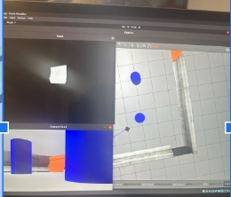
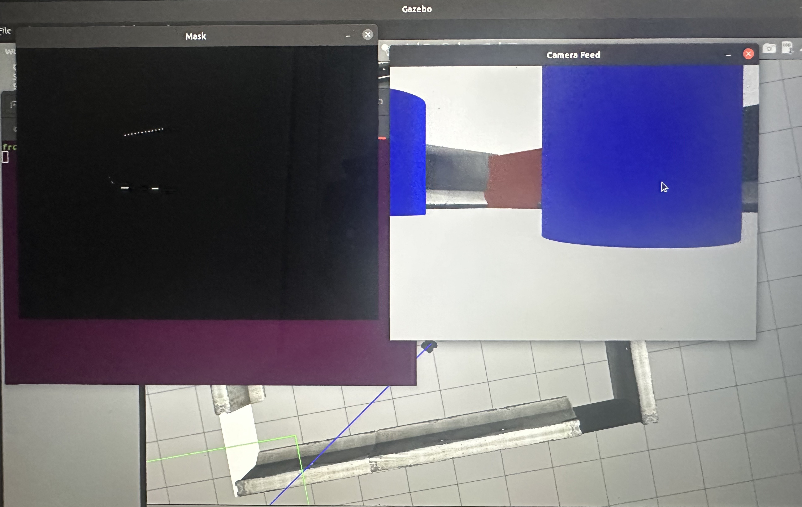

# Autonomous Color Navigation 🤖🎨

This project showcases a ROS-based autonomous mobile robot developed by **Jah-Vin and Ridhoy**. The robot is capable of **tracking a sequence of colored targets** while intelligently **avoiding obstacles in real-time**. The project was built using TurtleBot3 in a Gazebo simulation environment.

---

## 📸 Demo Preview

*Tracking on an orange object*

*Dark shade of orange not being detected due too HSV values being too strict*

---

## 📌 Features

### 🎯 Color Recognition (Jah-Vin)

- **Purpose**: Detect and approach colored targets in a set sequence:
  `orange → white → yellow → black`
- **Techniques**:
  - HSV-based color thresholding
  - Binary masking and contour detection
  - Proportional control (adjust speed/direction based on target size & position)
  - Finite State Machine (`SEARCHING`, `MOVING`, `NEAR_TARGET`)

### 🛡 Obstacle Avoidance (Ridhoy)

- **Purpose**: Prevent collisions by adjusting motion commands based on LIDAR data.
- **Zones Checked**: `front`, `left`, `right`
- **Behavior**:
  - Stop & rotate if obstacle ahead
  - Steer away from left/right-side obstacles
  - Continue moving if path is clear

---

## 🔄 Node Architecture

| Node              | Input Topics                     | Output Topics |
|-------------------|----------------------------------|----------------|
| Color Tracking     | `/camera/rgb/image_raw`          | `/safe_cmd_vel` |
| Obstacle Avoidance | `/scan`, `/safe_cmd_vel`         | `/cmd_vel`     |

---

## 🛠️ How It Works

### Color Tracker Node
- Converts RGB feed to HSV
- Generates a binary mask for the current target color
- Calculates position and area of the largest contour
- Adjusts robot's velocity to center and approach the target

### Obstacle Avoidance Node
- Reads laser scan data from `/scan`
- Divides scan into zones (front, left, right)
- Modifies velocity commands before publishing to `/cmd_vel`

---

## 🐞 Issues Encountered & Fixes

- **Color Detection Problems**: Shadows distorted orange detection; solved by refining HSV values and adding lighting.
- **Target Switching Too Early**: Fixed by checking contour area to ensure the robot is near enough before switching.
- **Obstacle Detection Reliability**:
  - Version 1: Basic logic, limited features.
  - Version 2: Introduced bumper logic and randomization for better recovery.

---

## 📹 Video

[

---

## 🙌 Authors

- Jah-Vin – Color Tracking Node
- Ridhoy – Obstacle Avoidance Node

---

## 🧠 Future Improvements

- Real-world robot deployment
- Dynamic lighting adaptation
- Integration of object detection for advanced navigation

